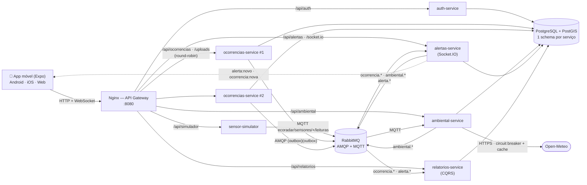
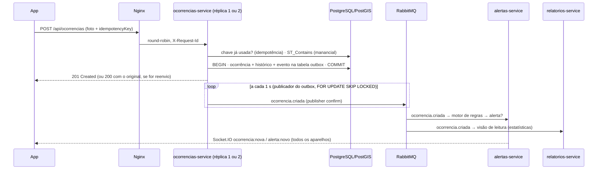

# EcoRadar Urbano

Aplicação de **sistema distribuído para dispositivo móvel** para o gerenciamento colaborativo de informações
ambientais urbanas: poluição do ar, trânsito e transporte público, alagamentos, invasão de mananciais,
desmatamento, inversão térmica, queimadas e descarte irregular de lixo.

APS — Ciência da Computação (UNIP), 7º/8º semestre, 2026.

- **Como testar no celular:** [COMO_TESTAR.md](COMO_TESTAR.md)
- **Evidências (prints, vídeos, logs, relatórios):** [registros/index.html](registros/index.html) · [RELATORIO_DE_TESTES.md](registros/RELATORIO_DE_TESTES.md)
- **Andamento e decisões:** [PROGRESSO.md](PROGRESSO.md)

## Funcionalidades

| Área | O que o app faz |
|---|---|
| Ocorrências | Registro com categoria, severidade, descrição, **foto** (câmera/galeria) e **GPS** com ajuste no mapa; aviso quando o ponto está em **área de manancial**; lista com busca, filtros, ordenação e "perto de mim"; detalhe com histórico; **confirmação colaborativa** |
| Mapa | Ocorrências (cor = severidade, ícone = categoria), estações com **IQAr**, polígonos dos mananciais Guarapiranga e Billings, atualização **em tempo real** |
| Qualidade ambiental | **IQAr** por estação (faixas oficiais da **CETESB**), poluentes, temperatura, **inversão térmica**, nível dos córregos, gráfico de 24 h e dados da API pública **Open-Meteo** (ao vivo ou em cache) |
| Alertas | Motor de regras (poluição, risco de alagamento, inversão térmica, concentração de ocorrências, prioridade em manancial) com deduplicação; **banner, notificação local e badge** em tempo real |
| Relatórios | Indicadores, gráficos por status/categoria/dia, áreas mais críticas, **exportação PDF e CSV** |
| Offline | Faixa "Você está offline", **fila persistente** com chave de idempotência e sincronização automática; dados em cache |
| Arquitetura visível | Tela **Status do sistema**: saúde e latência de cada microsserviço, réplica que respondeu, teste de balanceamento, circuit breaker, WebSocket, MQTT, AMQP e outbox |
| Perfis | Cidadão, **Agente** (painel com fila e alteração de status) e **Admin** (também dispara cenários do simulador e a falha simulada da Open-Meteo) |

## Arquitetura



### Registro de uma ocorrência (outbox, eventos e tempo real)



### Serviços e portas

| Serviço | Réplicas | Porta interna | Rotas no gateway | Responsabilidade |
|---|---|---|---|---|
| gateway (Nginx 1.30) | 1 | **8080 (pública)** | — | Ponto único de entrada, round-robin, WebSocket, `X-Request-Id`, app web |
| auth-service | 1 | 3000 | `/api/auth/*` | Cadastro, login (JWT 12 h, bcrypt, rate limit), perfis |
| ocorrencias-service | **2** | 3000 | `/api/ocorrencias*`, `/uploads/*` | Ocorrências, PostGIS, fotos, idempotência, confirmação, status, **outbox** |
| ambiental-service | 1 | 3000 | `/api/ambiental/*` | MQTT, IQAr, inversão térmica, córregos, Open-Meteo |
| alertas-service | 1 | 3000 | `/api/alertas*`, `/socket.io/*` | Motor de regras, deduplicação, Socket.IO |
| relatorios-service | 1 | 3000 | `/api/relatorios/*` | Visão de leitura (CQRS), estatísticas, PDF e CSV |
| sensor-simulator | 1 | 3000 | `/api/simulador/*` | 6 estações virtuais publicando a cada 5 s; cenários de demonstração |
| postgres (PostGIS 3.6 / PG 18) | 1 | 5432 | — | Um schema e um usuário por serviço |
| rabbitmq (4.3) | 1 | 5672 (AMQP), 1883 (MQTT) | — | Eventos entre serviços e telemetria; **painel em http://localhost:15672** |

Documentação OpenAPI (Swagger UI) de cada serviço: `http://localhost:8080/api/<auth|ocorrencias|ambiental|alertas|relatorios|simulador>/docs`.

### Padrões de sistemas distribuídos implementados

- **API Gateway** e **balanceamento de carga** (round-robin entre 2 réplicas, com repetição na outra réplica em caso de falha de conexão)
- **Database per service** (schema + usuário próprios; nenhum serviço lê o banco de outro)
- **Mensageria assíncrona**: AMQP (exchange `topic` + DLQ) e **MQTT** para sensores
- **Transactional Outbox** (evento gravado na mesma transação; publicação com *publisher confirms*)
- **Consumidor idempotente** (inbox) e **idempotência** na criação (chave gerada pelo app)
- **CQRS** simplificado no relatorios-service, com controle de versão contra eventos fora de ordem
- **Circuit breaker**, **timeout**, **cache com TTL** persistido e **degradação graciosa** (Open-Meteo)
- **Retry com backoff exponencial + jitter** (AMQP, MQTT, banco, app)
- **Correlação** por `X-Request-Id` (gateway → serviços → eventos → consumidores) e `X-Instance-Id`
- **Health checks** (`/health` e `/ready`), **encerramento gracioso** (SIGTERM), notificações em **tempo real** (Socket.IO com JWT)

## Stack

| Camada | Tecnologias |
|---|---|
| App | React Native 0.86 + **Expo SDK 57**, TypeScript, Expo Router, React Native Paper (Material 3), Zustand, TanStack Query (cache persistido), Axios, react-native-maps / react-leaflet + OpenStreetMap, react-native-gifted-charts, Socket.IO, expo-location, expo-image-picker, expo-notifications, expo-secure-store, NetInfo |
| Backend | Node.js 24 LTS, TypeScript 6, Fastify 5, Zod 4, Drizzle ORM + drizzle-kit, pino, opossum, amqplib, mqtt, Socket.IO, pdfkit, bcryptjs, JWT |
| Infra | Docker Compose (healthchecks + `depends_on: service_healthy`), Nginx, RabbitMQ (AMQP + MQTT), PostgreSQL + PostGIS |
| Testes | Vitest (unitários com cobertura, integração), Playwright (E2E com prints e vídeos), autocannon (carga), scripts de falha com Docker |

## Estrutura de pastas

```
backend/     npm workspaces: packages/shared (código comum) · services/* (6 microsserviços) · seed/
mobile/      app Expo (src/app = telas do Expo Router; componentes, estado, serviços, tema)
gateway/     nginx.conf e página inicial do gateway
infra/       init.sql do PostgreSQL (schemas/usuários) e configuração do RabbitMQ (plugins MQTT/gerenciamento)
tests/       integracao/ · e2e/ · distribuido/ · carga/ · infra/ · utils/ · scripts/ (orquestração das evidências)
scripts/     iniciar · parar · configurar-ip · rodar-todos-testes · coletar-evidencias (PowerShell e Bash)
registros/   evidências geradas por execuções reais (ver registros/README.md)
```

## Como rodar

Pré-requisitos: **Docker** (Docker Desktop no Windows/macOS) e **Node.js 24 LTS**.

```powershell
# Windows (PowerShell)
powershell -ExecutionPolicy Bypass -File scripts\iniciar.ps1          # sobe tudo do zero + dados de demonstração
powershell -ExecutionPolicy Bypass -File scripts\configurar-ip.ps1    # grava o IP da rede local em mobile/.env
cd mobile; npm install; npx expo start --clear                        # QR code para o Expo Go
```

```bash
# Linux/macOS
./scripts/iniciar.sh && ./scripts/configurar-ip.sh
cd mobile && npm install && npx expo start --clear
```

- API e app web: **http://localhost:8080** · RabbitMQ: **http://localhost:15672**
- Parar: `scripts/parar` (`-Limpar`/`--limpar` apaga os volumes)
- Testes: `scripts/rodar-todos-testes` · Evidências completas: `scripts/coletar-evidencias`
- Passo a passo para o celular, firewall e solução de problemas: [COMO_TESTAR.md](COMO_TESTAR.md)

## Variáveis de ambiente (`.env`, criado a partir de `.env.example`)

| Variável | Padrão | Uso |
|---|---|---|
| `GATEWAY_PORTA` | `8080` | Porta pública do Nginx |
| `POSTGRES_DB` / `POSTGRES_USER` / `POSTGRES_PASSWORD` | `ecoradar` / `ecoradar_admin` / (dev) | Banco e administrador (usado só pelo seed) |
| `DB_SENHA_AUTH`, `DB_SENHA_OCORRENCIAS`, `DB_SENHA_AMBIENTAL`, `DB_SENHA_ALERTAS`, `DB_SENHA_RELATORIOS` | (dev) | Senha do usuário de banco de cada serviço (iguais às do `infra/postgres/init.sql`) |
| `RABBITMQ_USUARIO` / `RABBITMQ_SENHA` / `RABBITMQ_PAINEL_PORTA` | `ecoradar` / (dev) / `15672` | Broker (AMQP, MQTT e painel) |
| `JWT_SEGREDO` / `JWT_VALIDADE` | (dev) / `12h` | Assinatura e validade do token |
| `CIDADE_PADRAO_NOME` / `_LAT` / `_LON` | São Paulo/SP, -23.5505, -46.6333 | Cidade usada na Open-Meteo e no app |
| `OPEN_METEO_AR_URL` / `OPEN_METEO_CLIMA_URL` | APIs públicas | Endereços da Open-Meteo |
| `OPEN_METEO_CACHE_TTL_S` / `OPEN_METEO_TIMEOUT_MS` | `600` / `5000` | Cache (10 min) e timeout (5 s) |
| `SIMULADOR_INTERVALO_MS` | `5000` | Frequência das leituras simuladas |
| `LOG_NIVEL` / `CORS_ORIGEM` | `info` / `*` | Log dos serviços e CORS |
| `EXPO_PUBLIC_API_URL` (em `mobile/.env`) | `http://<IP>:8080` | Endereço do gateway para o celular (gerado por `configurar-ip`) |

## Testes e resultados

Os números abaixo vêm das execuções registradas em `registros/` (ver [RELATORIO_DE_TESTES.md](registros/RELATORIO_DE_TESTES.md)):

- **Unitários:** 105 testes; cobertura das regras de negócio ≈ 97% das linhas (meta ≥ 70%)
- **Integração** (stack real via gateway): fluxo completo + erros 401/403/404/409/413/415/422/429
- **E2E** (Playwright, Pixel 7 e iPhone 14): roteiro completo com prints numerados e vídeos, tempo real entre dois dispositivos, alerta disparado pelo admin, modo offline com idempotência e tema escuro
- **Sistema distribuído:** balanceamento, falha de réplica, queda do broker (outbox), falha da Open-Meteo (circuit breaker) e rastreamento por `X-Request-Id`
- **Carga** (autocannon): comparação entre 1 e 2 réplicas com p50/p95/p99

## Fontes e créditos

- **IQAr:** faixas da CETESB — "Padrões de Qualidade do Ar / Índice de Qualidade do Ar e Saúde", consultado em 27/09/2026:
  https://www.cetesb.sp.gov.br/cetesb/qualidade_ambiental/ar/informacoes_basicas/padroes_de_qualidade_do_ar
  (classificação vinculada à Resolução CONAMA nº 491/2018). Implementação e observações em `backend/services/ambiental-service/src/dominio/iqar.ts`.
- **Dados meteorológicos e de qualidade do ar:** [Open-Meteo](https://open-meteo.com/) (API gratuita, sem chave).
- **Mapas na web:** © colaboradores do [OpenStreetMap](https://www.openstreetmap.org/copyright), via Leaflet.
- **Mananciais:** polígonos **aproximados e simplificados**, desenhados para fins didáticos (não são os limites legais das APRMs).
- **Imagens** do seed, ícone e ilustrações: produzidas pelo próprio projeto (SVG → PNG/JPEG); nenhuma imagem de terceiros.
- Dados de demonstração são fictícios.
