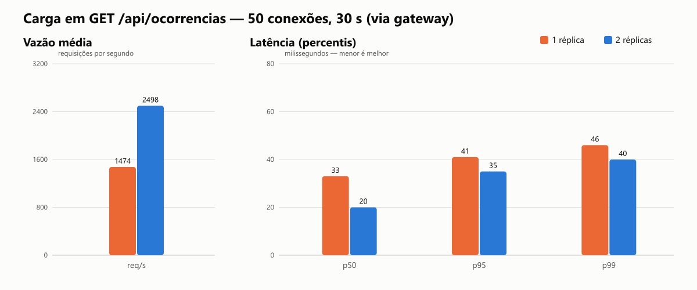

# Teste de carga — GET /api/ocorrencias

Executado em 27/09/2026, 23:55:32 com autocannon: 50 conexões simultâneas, 30 s por cenário (após 5 s de aquecimento), via gateway Nginx (http://localhost:8080).
Latências calculadas a partir do tempo de cada resposta registrado durante o teste.

| Cenário | Requisições | Req/s (média) | p50 (ms) | p95 (ms) | p99 (ms) | Média (ms) | Máx. (ms) | Erros/timeouts | Respostas não-2xx | Amostra de X-Instance-Id |
|---|---|---|---|---|---|---|---|---|---|---|
| 1 réplica | 44209 | 1474 | 33 | 41 | 46 | 34 | 226 | 0 | 0 | ocorrencias-1: 20 |
| 2 réplicas | 74916 | 2498 | 20 | 35 | 40 | 20 | 205 | 0 | 0 | ocorrencias-2: 10, ocorrencias-1: 10 |

**Variação da vazão com 2 réplicas: +69.5%** em relação a 1 réplica.

Observação: todos os containers (banco, broker, réplicas e gerador de carga) rodam no mesmo computador; o ganho
de escalar horizontalmente fica limitado pelos recursos compartilhados (CPU e PostgreSQL). Em produção, as réplicas
ficariam em máquinas distintas.

